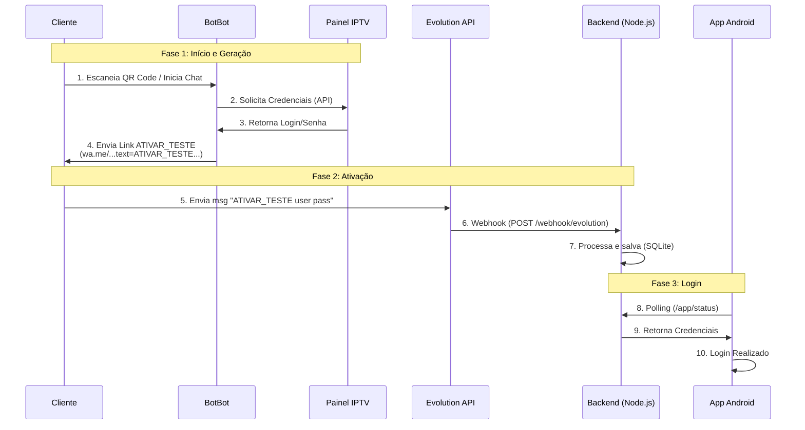

# Backend IPTV - Integração BlueTV

Este projeto é um backend em Node.js projetado para gerenciar a automação de testes de IPTV para o aplicativo Android, integrando-se com a Evolution API (WhatsApp), BotBot e Painel IPTV.

## 📋 Visão Geral do Projeto

O sistema automatiza a entrega de contas de teste via WhatsApp.
1. O **Cliente** escaneia um QRCode (no App/TV).
2. O **BotBot** inicia o atendimento e solicita a conta ao **Painel IPTV**.
3. O **BotBot** devolve um link de ativação para o cliente.
4. O **Cliente** clica e envia o comando `ATIVAR_TESTE` via WhatsApp.
5. O **Backend** processa, salva e libera o acesso no App.

## 🔄 Fluxo Completo de Ativação

Abaixo está o diagrama detalhando a interação completa, desde o QR Code:



## 🛠️ Arquitetura

- **Backend**: Node.js com Express
- **Banco de Dados**: SQLite3
- **Integração Externa**: Evolution API
- **Automação de Chat**: BotBot
- **Gestão de Contas**: Painel IPTV

## 🚀 Instalação e Configuração

### Pré-requisitos
- Node.js (v18 ou superior)
- Docker (para executar a Evolution API)

### Passos para Instalação

1. **Clone o repositório**:
   ```bash
   git clone <seu-repositorio>
   cd backend-iptv
   ```

2. **Instale as dependências**:
   ```bash
   npm install
   ```

3. **Inicie o Servidor**:
   ```bash
   npm start
   ```

## 🔌 API Endpoints Principais

### Webhook Evolution
- `POST /webhook/evolution`: Recebe o comando `ATIVAR_TESTE` enviado pelo cliente.

### App Android
- `POST /app/request`: Inicia o processo pelo lado do App (gera QR Code/Link).
- `GET /app/status`: Verifica se o teste foi ativado.

---
**Desenvolvido para automação do ecossistema BlueTV.**
